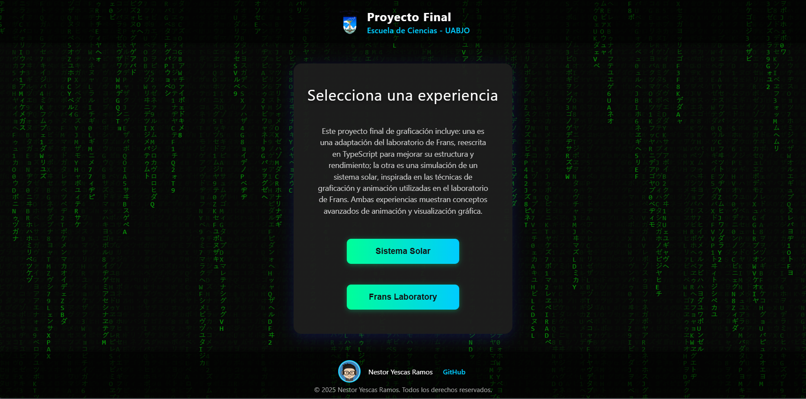
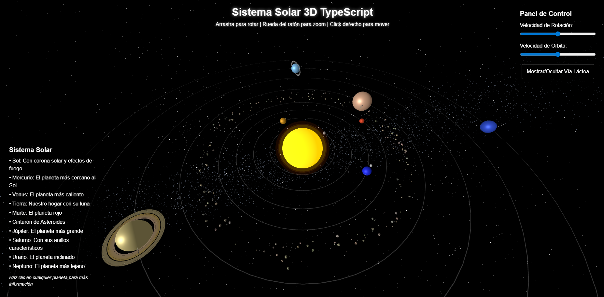
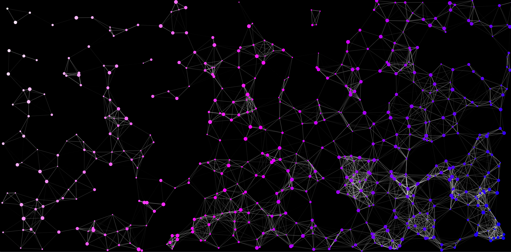
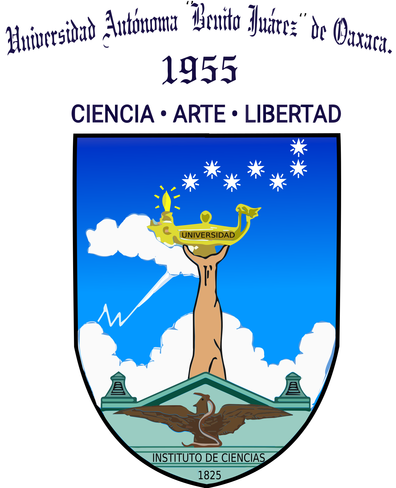

# Proyecto Final de Graficación - Escuela De Ciencias - UABJO

Este repositorio contiene el proyecto final de la materia de Graficación, desarrollado en TypeScript y Webpack. Incluye dos experiencias interactivas:

- **Frans Laboratory (Partículas)**: Inicialmente adapté el ejercicio clásico del laboratorio de Frans, reescribiéndolo en TypeScript para mejorar su estructura y rendimiento, agregando animación de partículas y conexiones dinámicas. Sin embargo, al finalizarlo sentí que era un reto muy sencillo y limitado, por lo que decidí complementar el proyecto desarrollando una segunda experiencia más compleja y visualmente atractiva.

- **Sistema Solar 3D**: Este es el proyecto principal que decidí desarrollar, inspirado y basado en los proyectos de Frans Laboratory. Utiliza muchas de las herramientas y técnicas vistas en esos ejercicios, pero adaptadas y extendidas para crear una experiencia original y más compleja, reescrita completamente en TypeScript. El resultado es una simulación visual y animada de un sistema solar, con controles interactivos y efectos avanzados.

## 🛠️ Tecnologías utilizadas

### Webpack

Utilicé Webpack para facilitar el desarrollo, mejorar la organización del código y asegurarme de que la aplicación funcione correctamente y de manera eficiente en cualquier navegador, además de simplificar el despliegue en producción (por ejemplo, en GitHub Pages).

## 🚀 Demo

Puedes ver el proyecto en acción (por ejemplo, en GitHub Pages):

```
https://nessgoodess.github.io/ts-graficacion-final/
```
## 📸 Capturas de pantalla

### Menú principal


### Sistema Solar


### Frans Laboratory


## 🗂️ Estructura del proyecto

```
├── public/
│   ├── index.html
│   ├── SolarSystem.html
│   ├── FransLaboratory.html
│   └── assets/
├── src/
|   |──data/
|   |──interfaces/
|   |──models/
|   |──utils/
│   ├── solarSystem.ts
│   ├── menu.ts
│   └── Particles-FransLaboratory.ts
├── dist/
│   └── ... (archivos generados por Webpack)
├── webpack.config.ts
└── README.md
```

## ⚙️ Instalación y uso

1. Instala dependencias:
   ```bash
   npm install
   ```

2. Compila el proyecto:
   ```bash
   npx webpack --mode=production
   ```

3. Sirve la carpeta `dist`:
   ```bash
   npx serve dist
   ```
4. Luego abre tu navegador y ve a:
   - Localhost: http://localhost:9000/

## 📝 Créditos

- **Nestor Yescas Ramos**  
  <a href="https://github.com/NessGoodess">
    
  </a>
- **Universidad Autónoma Benito Juárez de Oaxaca (UABJO)**  
  

- **Frans Laboratory**  
  <a href="https://www.youtube.com/@Frankslaboratory">
    
  </a>

---

> **Nota:** 

### ¿Para qué sirve Webpack y por qué lo utilicé en este proyecto?

Webpack es una herramienta llamada "empaquetador de módulos" (module bundler). Su función principal es tomar todos los archivos de tu proyecto (JavaScript, TypeScript, CSS, imágenes, etc.), analizarlos y combinarlos en uno o varios archivos finales optimizados para producción.

### ¿Por qué usé Webpack en este proyecto?

- Organización: Permite dividir el código en módulos y archivos pequeños, pero al final los une en un solo archivo para que el navegador lo cargue más rápido.
- Compatibilidad: Transforma código moderno (por ejemplo, TypeScript o ES6+) a una versión que todos los navegadores puedan entender.
- Optimización: Minimiza y optimiza los archivos finales, haciendo que la página cargue más rápido.
- Automatización: Permite automatizar tareas como copiar archivos estáticos, procesar CSS, imágenes, etc.
- Desarrollo más fácil: Con Webpack puedes usar herramientas como "hot reload" para ver los cambios en tiempo real mientras desarrollas.